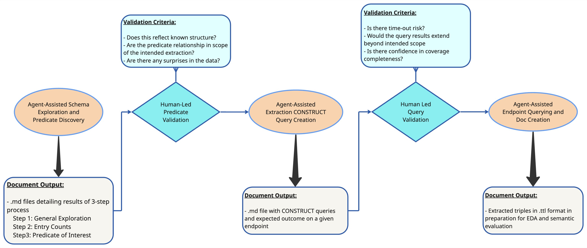

# Introduction

As part of the DBCLS BioHackathon 2026, we developed tools and workflows for identifying and extracting target data from RDF resources with complex schema and named-graph structures. This work was carried out in the context of the Human Glycome Atlas Project (HGA) and the development of the Total Human Saccharide Atlas (TOHSA), which aims to integrate human glycoscience data into a linked knowledge resource. Existing resources such as GlyCosmos contain relevant information about glycans, glycoproteins, genes, pathways, diseases, and related biological entities, but these data are distributed across multiple datasets, graph structures, identifiers, and schema conventions. Building a human-focused resource from these sources therefore requires a reproducible way to determine which data are in scope, how those data are connected, and how they should be extracted.

Large language model (LLM)-based agents can assist with this type of schema exploration by examining repository configuration, generating exploratory SPARQL queries, following graph relationships, and documenting observations. However, the resulting decisions still require validation by subject matter experts. We therefore developed an agent-assisted data extraction workflow that alternates between agent execution and human validation. The workflow covers schema exploration, identification of human-specific criteria, predicate discovery, drafting of SPARQL `CONSTRUCT` queries, validation of those queries, and extraction of RDF in Turtle format. A companion SPARQL endpoint tool was also developed to support inspection and evaluation of the data during this process.

The extraction process also exposed problems that begin after the target RDF has been identified. TOHSA must represent derived scientific relationships consistently, serve the resulting RDF through database engines without unintended changes in query behavior, and prevent access-controlled data from being exposed outside an authorized context. We therefore extended the BioHackathon work beyond extraction to examine materialization before serving, RDF engine conformance, the AAII authorization boundary, and stronger isolation of protected data. Together, these activities address a connected workflow from source-data exploration and extraction through semantic serving and governed access.

<!--
## Meeting information

If you want to submit a preprint to BioHackrXiv, first check if your meeting is registered. You can find a list
of meetings [here](https://index.biohackrxiv.org/meetings). If your meeting is missing, please contact your meeting
organizers. The above list also provides information on the YAML fields with information about the meeting.

The following fields need to be given:

```YAML
biohackathon_name: "DBCLS BioHackathon 2026"
biohackathon_url:   "https://2026.biohackathon.org/"
biohackathon_location: "Matsuyama, Japan, 2026"
group: YOUR-PROJECT-NAME-GOES-HERE
git_url: https://github.com/yourOrganization/your_report_repo
```

The [BioHackrXiv meeting pages](https://index.biohackrxiv.org/meetings) provide content to use for the first
three fields. The `git_url:` field must have the link to the GitHub repository with your preprint (draft).

## Author information

Information about the authors is given in the [YAML](https://en.wikipedia.org/wiki/YAML) format at the top of this template.
For authors you provide their names, their affiliations. That is the minimum, but as BioHackrXiv is moving to a situation
where more metadata is shared, and used by, for example, EuropePMC, adding additional information ie encouraged.

BioHackathons is about hacking together, and the minimal number of authors for reports is two. This makes a minimal example
look like this:

```yaml
authors:
  - name: First Author
    affiliation: 1
  - name: Last Author
    affiliation: 2
affiliations:
  - name: First Affiliation
    index: 1
  - name: ELIXIR Europe
    index: 2
```

### Author identifiers

Ideally, authors provide their [ORCID](https://orcid.org/) identifier. For affiliations, It is added with the `orcid:` field.
So, and author record would look like this:

```yaml
authors:
  - name: First Author
    affiliation: 1
    orcid: 0000-0000-0000-0000
```

### Research Organization Registry identifiers

Matching the author identifier, the affiliations can be further specified with the
[Research Organization Registry](https://ror.org/) (ROR) identifier.
For example, this is the affiliation identifier can be added with the `ror:` field:

```yaml
affiliations:
  - name: ELIXIR Europe
    ror: 044rwnt51
    index: 2
```

### Contributor Role Taxonomy

A last feature since is minimal support for the Contributor Role Taxonomy (CRediT). You
can specify the role of authors in writing the report with the `role:` field. However,
the authors are responsible for selection the right terms from [CRediT](https://credit.niso.org/).
An example looks like this:

```yaml
authors:
  - name: First Author
    affiliation: 1
    orcid: 0000-0000-0000-0000
    role: Conceptualization, Writing – review & editing
```

### A full examples

A full example then has this structure:

```yaml
authors:
  - name: First Author
    affiliation: 1
    role: Writing – original draft
  - name: Last Author
    orcid: 0000-0000-0000-0000
    affiliation: 2
    role: Conceptualization, Writing – review & editing
affiliations:
  - name: First Affiliation
    index: 1
  - name: ELIXIR Europe
    ror: 044rwnt51
    index: 2
```

# Formatting

This document use Markdown and you can look at [this tutorial](https://www.markdowntutorial.com/).

## Subsection level 2

Please keep sections to a maximum of only two levels.

## Tables

Tables can be added in the following way, though alternatives are possible:

```markdown
Table: Note that table caption is automatically numbered and should be
given before the table itself.

| Header 1 | Header 2 |
| -------- | -------- |
| item 1 | item 2 |
| item 3 | item 4 |
```

This gives:

Table: Note that table caption is automatically numbered and should be
given before the table itself.

| Header 1 | Header 2 |
| -------- | -------- |
| item 1 | item 2 |
| item 3 | item 4 |

## Figures

A figure is added with:

```markdown

```

This gives:


Figures can be scaled by adding the width or height to the Markdown like this:

```markdown
{ width=50px }
```

You can add cross references to figures by adding a LaTeX `\label{figureCode}` to
the label of the Markdown figure and then use `\ref{figureCode}` to cite it:

```markdown
{ width=50px }
```

This way, we can cite Figure \ref{figureCode}.

# Other main section on your manuscript level 1

Lists can be added with:

1. Item 1
2. Item 2

# Citation Typing Ontology annotation

You can use [CiTO](http://purl.org/spar/cito/2018-02-12) annotations, as explained in [this BioHackathon Europe 2021 write up](https://raw.githubusercontent.com/biohackrxiv/bhxiv-metadata/main/doc/elixir_biohackathon2021/paper.md) and [this CiTO Pilot](https://www.biomedcentral.com/collections/cito).
Using this template, you can cite an article and indicate _why_ you cite that article, for instance DisGeNET-RDF [@citesAsAuthority:Queralt2016].

The syntax in Markdown is as follows: a single intention annotation looks like
`[@usesMethodIn:Krewinkel2017]`; two or more intentions are separated
with colons, like `[@extends:discusses:Nielsen2017Scholia]`. When you cite two
different articles, you use this syntax: `[@citesAsDataSource:Ammar2022ETL; @citesAsDataSource:Arend2022BioHackEU22]`.

Possible CiTO typing annotation include:

* citesAsDataSource: when you point the reader to a source of data which may explain a claim
* usesDataFrom: when you reuse somehow (and elaborate on) the data in the cited entity
* usesMethodIn
* citesAsAuthority
* citesAsEvidence
* citesAsPotentialSolution
* citesAsRecommendedReading
* citesAsRelated
* citesAsSourceDocument
* citesForInformation
* confirms
* documents
* providesDataFor
* obtainsSupportFrom
* discusses
* extends
* agreesWith
* disagreesWith
* updates

There is a general `cites` intention, but this is already implied and should be left out.
-->

# Abstract
The Human Glycome Atlas Project aims to integrate human glycoscience data into a linked RDF resource connecting glycans and glycoconjugates with their biological context. Constructing such a resource from existing knowledge bases requires reproducible identification and extraction of human-relevant data, preservation of semantic behavior when the resulting RDF is served through different graph engines, and appropriate control over access to protected data. During DBCLS BioHackathon 2026, we developed an agent-assisted, human-validated workflow for exploring complex RDF schemas and generating SPARQL CONSTRUCT extraction queries. We further developed a cross-engine conformance framework for evaluating RDF serving behavior and advanced the AAII authorization architecture used to mediate access to TOHSA data. Together, these activities connect source-data discovery, reproducible extraction, semantic serving, and governed access into a common workflow for constructing and operating the TOHSA knowledge base.

# Agentic Assisted Data Extraction 
The workflow implemented at BioHackathon is an exchange of supervised task execution by the agent, and validation by the subject matter experts. The workflow (depicted below) consists of agent exploration, human validation, agent creation of extraction queries, human evaluation of those queries, and finally agent-facilitated querying of the endpoint with CONSTRUCT queries resulting in data files written in .ttl format. These files are meant to be compatible with mathematic evaluation via Exploratory Data Analysis (EDA) and/or semantic evaluation via human-facilitated querying. Developing the criteria for those evaluation steps was outside the scope of this BioHackathon, but it is planned as a future step for this project. All steps are intended to be iterable within and across themselves to allow for dynamic and documented changes resulting from discoveries about the data, changes in desired target or scope, or adjustments due to human or agent error.



## Multi-Step Schema Exploration
To provide understanding about the structure of the linked data, a three-step analysis is applied to each dataset. The agent determines which files in the context repository feed into which named graph, what predicate points to taxonomic information, and what corresponding object marks a resource as human. This is done while consulting the available config files, and ultimately confirms the veracity of all observations with live queries. The exploration queries return the full human IRI count, picking one richly connected real instance and follows every predicate out from it to determine the range of relevant triples. This path exploration identifies what is safe to include in an extraction scope, what is a shared resource across graphs and potentially needs its own table, and whether or not a predicate carries a fan-out risk.

For each step, the agent creates an .md file that describes observations about the data structure. This analysis is not static, and if future steps reveal something previously unknown or poorly categorized, the agent returns to the .md document and amends it before the task is declared complete and the full .md file shared with the user. The details included in those observations are described below:

**Step One: extraction criteria.** Defines which predicate and value combination marks a resource as whatever the intended extraction target, in this case as human. This step runs queries with the intention of proving every claim with a live SPARQL query, and states plainly where a criterion rests in a dataset's documented scope. These queries are saved as separate files in the appropriate directory, and are directly hyperlink-referenced in the observations summary. 

**Step Two: entry counts.** Runs count queries for target criterion from step one against the full live dataset without `LIMIT` conditions, and records the returned count with the query used to obtain it. Where more than one independent signal exists for the same criterion, this step check them against each other and investigates any disagreement with additional queries to the live endpoint rather than picking one arbitrarily.

**Step Three, predicate discovery.** Selects one richly linked, already confirmed instance and enumerates every predicate on every resource directly reachable from it, unrestricted. This identifies which predicates could be problematic during an extraction step. Problematic predicates include those that result in a fan-out path because the object URI is cited by thousands of other records, opaque identifiers with no further content, and predicates that are mislabeled. These predicates and paths are caught before they become a silent gap or an unbounded query in a production pipeline.

Below is a summarized example of the conclusions from an agent-assisted exploration of multiple datasets:

| Dataset | Criterion | Count | Key finding |
|---|---|---|---|
| Disease | Two levels, DOID membership (concept) plus gene or glycoprotein `glycan:has_taxon` (molecular evidence) | 4115 of 4372 | The invented `pipeline:hasPhenotype` predicate was found and replaced with the real four hop bridge |
| Pathways | `biopax3:organism`, direct, confirmed two independent ways | 2870 of 23486 | Three pipeline bugs found in a deep cross check, a self referencing related pathway bug, a missed nested sub pathway reaction gap, and an uncollected output variable |
| Genes | `glycan:has_taxon` directly on `glycan:Glycogene` | 10276 | A ggdb (GlycoGeneDataBase) sub analysis was built separately on that named graph's own rich reaction content |
| Glycoproteins | `glycan:has_taxon` directly on `glycan:Glycoprotein` | 16711 | A numeric pattern gene target's own triples span six graphs, not two; a related_graphs sub analysis covered four further graphs (gpdb, HPA, lipidmaps_gene, protein_egf) |
| Lectins | `glycan:has_taxon` directly on `sugarbind:Lectin` | 318 of 6298 | CarboGrove, reached through one `rdfs:seeAlso` hop, expands into 1.3 million triples, a confirmed fan out hub, excluded |
| Glycans | Two hop `glycan:is_from_source`/`glycan:has_taxon` | 8042 of 265401 | A directory named `external` holds none of the resource type its name implies; the extraction package's own inference dependent query proved unnecessary; two pipeline bugs found and fixed |
| Glycolipids | None exists, confirmed by exhaustive live checking | 6046 (full population, no species filter possible) of 6280 store wide | No species predicate anywhere in the dataset; the scope decision to cover the full population was made without a response from the person directing the work, and is flagged for confirmation |

## `CONSTRUCT` Query Drafting
Once the subject matter confirms that the agent has an accurate representation of the data structure and how the target data fits into that structure, the agent begins to draft CONSTRUCT queries. Compared to extraction with `SELECT` queries, `CONSTRUCT` queries do not require an additional step of triple reconstruction across tables, and ensure fidelity between target triples and the extracted triples. The agent crafts those queries with a multi-step decision process:

**Step One: verify instance schema** The expert's own instance level schema diagram (in .png or .yaml format) is checked edge by edge against the live endpoint before a single query is written. Every edge it shows is either confirmed real and present exactly as drawn, or the discrepancy is surfaced immediately and documented for expert review.

**Step Two: verify filter scope** A target criteria can restrict which entries appear in a query, or it can restrict which entries get expanded. These are different decisions, and a `CONSTRCT` query has to be deliberate about which one it is making. Verification at this decision point is important to ensure outputs do not include dangling references.

**Step Three: split queries that cause timeout errors** Performance is checked by the agent while a query is still being drafted, and splits into separate queries if necessary. The split is kept permanently in the document once drafted. This is out of abundance of caution, and is a decision point to address if significant changes are made to the database that make the split unnecessary, or require a split along a different retrieval pattern. 

**Step Four: retain pointer URI discipline** Object URIs that were previously identified as the end of an extraction pattern, aka a "pointer URI", are confirmed and the restriction discipline that was established in that dataset's own `tohsa_step3_predicate_discovery.md` is maintained.

**Step Five: perform deep cross check** Before the `CONSTRUCT` query document is published for an expert's independent review, a full adversarial pass over all drafted queries for the dataset of interest is run after the rest of the document otherwise looks complete. Every check is live against the endpoint, not inferred from the previous query text.

**Step Six: correct and amend queries based on expert review** A second round of expert review can show an earlier query was incomplete or incorrect. When a specific numeric disagreement is raised by the expert, it is first confirmed by reproducing the expert's own query. Then if target triple coverage is insufficient or incorrect, an ammendment is noted in the prose documents, and the incorrect query is overwritten. For example, the first draft of queries for the Disease dataset contained a "Query C" that restricted a phenotype bridge to cross references containing the literal string "OMIM". A second expert diagram showed this coverage is incomplete, and the corrected version was replaced with a new Query D, with a short note explaining why. Keeping both risks a future reader running the narrower, incomplete query by mistake.

**Step Seven: cite all queries in docs.** Every SPARQL query used for confirmation, exploration, and cross checks, and worked example in `query.md` is linked to its own numbered entry in `refDocs/query.md`. The generated directory uses the same `[[N]](../refDocs/query.md#N-slug)` naming convention already used for `tohsa_step1_extraction_criteria.md` through `tohsa_step3_fetch_summary.md`, with its own independent numbering, not continuing the step documents' own sequence.

# Future Workflow Development 
The extraction workflow produces both the target RDF and a documented record of how the extraction scope was identified and validated. However, this record is prose heavy, and could be simplified into a more structured format that is still human readable, but easier for other agents to engage with. Standard RDF-config files in .yaml format are already commonly used to document RDF schema, and could serve as an appropriate addition to the prose. The simplified and structured .yaml files could facilitate new ways to extend the workflow beyond extraction as we continue development. 

Extraction is only the first step in incorporating these data into TOHSA. Once an extracted RDF dataset has been validated, the intended scientific relationships need to be represented consistently, the data need to be served without unintended changes in query results, and access-controlled data need to be exposed only through the appropriate authorized context. These requirements led to additional work on materialization, RDF engine evaluation, and the AAII authorization and serving architecture.

# RDF Engine Evaluation and Semantic Serving

The extraction workflow identifies which triples should be included in a human-focused dataset. Once those triples are incorporated into TOHSA, a different set of questions needs to be addressed. The same scientific data may be loaded into different RDF database engines, but those engines do not always treat graph construction, RDF terms, or SPARQL operations in exactly the same way. We therefore evaluated how TOHSA can separate the scientific meaning of the data from the behavior of the engine used to serve it.

## Materialization Before Serving

TOHSA combines RDF from multiple sources and may also create additional statements through ontology, mapping, or propagation rules. One option is to calculate those additional statements when a user submits a query. This makes the returned result dependent on the inference capabilities and configuration of the engine answering the query.

We instead explored materializing the required derived statements before the data are served. In this approach, the original statements and the derived statements intended to be part of TOHSA are written into a canonical release before that release is loaded into a database engine. Scientific inference can then be disabled during normal query serving.

This separates two problems that were initially being treated together. The first is whether the RDF release contains the scientific statements that TOHSA intends to provide. The second is whether an RDF engine correctly serves that release through the supported SPARQL query interface. Materialization addresses the first problem, but it does not guarantee the second.

A synthetic release was created to test this approach before applying it to the larger extracted GlyCosmos dataset. The release could be rebuilt deterministically from the same inputs, and the derived statements were stored directly in the resulting RDF. This also allowed representation decisions to be tested independently from engine behavior. For example, integer lexical forms could be normalized during release construction while preserving their RDF datatype identity. Decimal and floating-point normalization were not included because the meaning of lexical precision for measurement values still needs to be determined.

## RDF Engine Conformance Evaluation

After materialization was separated from query-time inference, the next step was to determine whether different RDF engines could serve the same release with the behavior required by TOHSA. A conformance test suite was created for this purpose. The same synthetic release, test queries, and expected results were used for Virtuoso, QLever, and RDF4J NativeStore.

The tests covered areas where engine differences can change the result of a query, including default and named graph construction, RDF term identity, and SPARQL aggregation. The intention was not to determine which engine was generally better. The goal was to determine whether each engine satisfied the specific behavior required by the current TOHSA service profile.

Virtuoso showed a problem when the same triple occurred in more than one graph selected into the default dataset. The overlapping graphs could produce duplicate matches where RDF merge behavior should result in one triple. Dataset controls could correct which graphs were treated as default or named graphs, but did not correct this overlapping-graph behavior.

QLever handled the tested overlapping graph case correctly, but did not preserve some of the integer datatype distinctions present in the release. It also returned a different datatype for some aggregate results. Both Virtuoso and QLever changed the lexical form of the decimal value used in the test fixture.

RDF4J NativeStore was then tested as a third implementation. This was useful for determining whether failures seen in Virtuoso and QLever were common to all RDF engines or were specific to a particular implementation. RDF4J preserved the tested integer datatype and decimal lexical distinctions. It reproduced the overlapping graph behavior seen with Virtuoso and showed a separate counting difference for an aggregate over a successful result containing no bound variable.

No engine passed every required case in the current direct-serving profile. The failure patterns were also different between engines. This is important because it means that correcting results after they are returned from the engine is not a general solution. Adding `DISTINCT`, removing duplicate rows, or changing returned RDF datatypes could also change valid query results.

For this reason, the release and the query service are treated as separate responsibilities. The release defines the scientific RDF and any approved representation rules. The service profile defines the query behavior that TOHSA expects from an engine serving that release. An engine can only be used for that profile after its behavior has been tested against those requirements.

The synthetic test suite is intended to remain in use after real TOHSA data are available because each test isolates a specific RDF or SPARQL behavior. The next engine evaluation will use a canonical GlyCosmos-derived human dataset from the extraction work and will add queries based on the structure and scientific content of that dataset.

## AAII Authorization and Serving Boundary

Correct engine behavior does not determine whether a user is allowed to access a particular dataset. Authorization is handled separately by the TOHSA Authentication and Authorization Infrastructure (AAII), which sits between the requesting application and the RDF engine.

Earlier versions of the query path authorized a request and then transformed the SPARQL query before sending it to an engine. During the BioHackathon, this boundary was made more explicit. The authorization result is now retained as a structured query plan that includes the parsed query and the default and named graph sets that were authorized.

The engine adapter uses this authorized plan to create the query that will actually be sent to Virtuoso or QLever. Before execution, a verifier checks that the dataset and query being dispatched still match the authorized plan. This prevents a later transformation or engine-specific implementation detail from silently expanding the data available to the query.

Tests against running Virtuoso and QLever containers showed that unauthorized graph scope could be rejected before the query was executed. These tests evaluate authorization enforcement and are separate from the engine conformance tests described above. An engine may correctly receive only the graphs a user is authorized to access and still fail one of the semantic or query behavior requirements in the conformance suite.

The next step is to bind authorization to an identified release and to verify that the selected database target is actually serving that release. Prototype work demonstrated that a restricted reader can obtain release identity information from an isolated Virtuoso target without giving the reader unrestricted database or container-management access.

A separate unresolved question is who has the authority to publish the grants that connect a user to a particular protected data context. Existing agreements and configuration files may provide evidence for that decision, but the software should not automatically interpret them as live authorization. The governance process for publishing those grants remains to be defined.

## Protected Data and Workspace Isolation

Some TOHSA data may have access restrictions and cannot be exposed through the same unrestricted serving environment as public data. We therefore also explored whether protected RDF should be separated physically rather than relying only on query-time filtering inside a shared RDF database.

One prototype represented an authorized data context as a Workspace with an immutable WorkspaceRelease and a separate serving target. The prototype tested deterministic release identity, materialization over a defined set of inputs, separation between public and protected targets, rejection of release mismatches, and reconstruction of a serving target from the release artifacts.

This prototype used a strong isolation model in which the data needed for a protected context could be placed into its own serving target. It does not establish the final TOHSA production storage model. In particular, it is still undecided whether a protected context should contain its own copy of public data, whether public and protected data should be combined through another controlled mechanism, or whether another physical arrangement should be used.

The main result from this work is that protected data should not depend only on every query being correctly filtered inside a shared RDF store. Stronger physical separation can reduce the number of places where a mistake could expose protected data. The exact method used to combine public and protected knowledge still needs to be decided.

The Workspace model also separates the contents of a scientific data context from the permissions given to a user. A WorkspaceRelease identifies a specific set of data. An Access Grant describes what a particular user is allowed to do with that context. This allows multiple users to access the same release under different permissions without making a different scientific release for each user.

Together, these steps extend the extraction workflow into the serving side of TOHSA. The extraction process determines which source data are in scope. Materialization determines which derived statements are included before serving. Engine conformance testing checks whether an RDF engine can serve that release with the required behavior. AAII and the Workspace work then address which data context a user is allowed to query and how protected data can be isolated from unrestricted access.

# Ontological Data Investigation Nexus (ODIN)
ODIN is a workbench for writing, running, and comparing SPARQL queries as a team, built for researchers who work with public knowledge graphs they may or may not control. It descended from a SPARQL editor first built inside PDDEIMS, a system created to decide which parts of the GlyCosmos knowledge graph deserve extraction. Beyond running queries, ODIN keeps a shared log of every query any team member runs. The queries in this log are open to threaded comments, labels, and personal bookmarks. This turns what most tools treat as a private activity into a record the whole team can return to. It also asks each connected endpoint directly what classes and predicates it contains, since no external registry reliably answers that question, and builds runnable example queries from whatever it finds. A review of published SPARQL tools, together with YummyData, a service that scores the trustworthiness of biomedical endpoints, situates ODIN among close relatives that each solve one part of this problem but not the combination. This report describes ODIN's design, positions it against that related work, and states plainly what it does not attempt to solve.

Public knowledge graphs published through SPARQL endpoints are rarely self documenting. A researcher who wants to know what classes or predicates an endpoint actually uses cannot usually consult a registry. General purpose registries either do not exist, or they fall out of date faster than the graphs they describe. Existing SPARQL editors solve the mechanics of writing and running a query well, syntax highlighting, autocomplete, result formatting. Most still keep a person's query history private to that person, even when several colleagues are investigating the same endpoint at the same time.

ODIN was built inside a team already facing this problem directly, querying a publicly available GlyCosmos endpoint and a mirror of that endpoint. The goal was to decide which parts of the corresponding named graphs were relevant to a downstream, human focused dataset. That earlier effort, called PDDEIMS, recorded its findings by hand, a person reviewing a named graph and assigning it a color that marked the graph as worth extracting, needing filtering, or excluding outright. ODIN grew out of the SPARQL editor built inside PDDEIMS for that work. It kept growing once it became its own application, adding a shared log, endpoint comparison, and live schema discovery. A small statistics view now covers both the whole project and any single endpoint a person happens to be working in.

This paper describes what ODIN actually does, and places it against the closest tools found through a deliberate search of published work. It also draws a clear line against YummyData, a monitoring service from the same research community that solves an adjacent but distinct problem. The paper closes by stating plainly what ODIN does not attempt, since a tool is easier to evaluate once its edges are visible.

# Related Work

Several tools solve pieces of what ODIN does, though none combine them the same way.

A 2025 editor from the SIB, built on the widely used YASGUI editor, retrieves lightweight metadata from an endpoint at load time. It uses that metadata for autocomplete and for rendering example queries the endpoint publishes through SHACL. This matches ODIN's own habit of asking an endpoint directly what it contains, rather than trusting a separate document about it. The SIB editor works for one person at a time though, with no shared record of anyone's queries.

YASGUI itself, maintained by Triply, offers a workspace concept, a shared and versioned store of queries a team has chosen to keep, often linked to a Git repository. That is closer to a shared library than to an activity log. It tells a team which queries it decided were worth saving, not what anyone actually tried today or what a colleague thought about a particular result.

SPARQL Visualizer, presented at an earlier 2018 workshop specifically on linked data in construction, aimed at a related but distinct gap. It helped domain experts, developers, and ontology engineers communicate with each other during ontology design by sharing sample queries, data, and descriptions. Its goal resembles ODIN's shared log more closely than either of the tools above. It was built around discrete artifacts shared between phases of a design process though, not a continuously updated record of daily querying.

YummyData, from DBCLS, solves a different problem altogether. Life science datasets are frequently published through more than one provider, and a researcher often has no easy way to know which copy of a dataset to trust. YummyData answers that by crawling roughly sixty biomedical endpoints daily and scoring each one across six dimensions, availability, freshness, operation, usefulness, validity, and performance, with years of history behind every score. ODIN's own health check and per endpoint statistics do something narrower. They confirm an endpoint a team has already chosen is reachable right now and report roughly what it currently holds, without attempting the historical trend analysis that YummyData was built around.

None of these tools, taken individually, keep what ODIN keeps at its center, a log where every query any team member runs becomes visible to the rest of the team. Comment threads attach to individual runs there, which none of the tools above offer either. This particular search was not exhaustive by any means. Something closer to ODIN may still exist outside what a handful of queries against published literature could ever surface.

# Design and Implementation

ODIN follows the same architectural instinct as PDDEIMS, the project it descended from. Every user account, endpoint definition, comment, and cached schema result lives in an ordinary file on disk, read when needed and rewritten in full when something changes. A single Python program, built on the language's own standard library, serves the whole application, with no web framework and no database underneath it. This choice keeps the entire state of the application readable and copyable by anyone with basic tools, without requiring familiarity with a query language first.

A person picks an endpoint from a curated catalog spanning more than a hundred sources, across domains including life sciences, cultural heritage, and geography. A query can run against one endpoint alone or against as many as three at once, with each response shown in its own pane. Every run, regardless of who made it, is recorded in a shared log searchable by endpoint, outcome, or free text. Any entry there can carry threaded comments, labels, and a personal star visible only to the person who set it.

Because no registry reliably describes what classes and predicates a given endpoint contains, ODIN asks the endpoint directly, sending one query for distinct classes and another for distinct predicates. The result is cached so the same question is not repeated unnecessarily. From whatever it finds, ODIN builds a small set of runnable example queries a person can use with one click. A separate view reports live statistics for the whole project, endpoint counts, query volume, comment activity. It reports the same kind of thing again for whichever single endpoint a person happens to be working in, triple counts, class and predicate counts, and named graph counts. All of it is pulled fresh on each request rather than stored and aged.

# Discussion

Read together, the comparisons in this paper suggest ODIN addresses a small set of separate problems rather than one large one.

A team investigating a shared endpoint has no default record of its own work. Most query tools keep a private history visible only to whoever typed the query, and ODIN's shared log exists specifically to close that gap.

No registry reliably describes what an endpoint actually contains, so ODIN asks the endpoint itself and builds examples from what it finds. That is the same instinct behind the SIB's own lightweight metadata approach, extended here into a shared, comment bearing record.

A team that has already selected its endpoints still needs a fast read on whether one is currently reachable and roughly how large it is. YummyData answers a broader version of this question for endpoints nobody has chosen yet. ODIN answers a narrower one for endpoints a team is already committed to.

Two related sources sometimes disagree, and that disagreement is easy to miss reading one answer at a time. Placing both results side by side, ODIN's comparison view, makes the disagreement visible without extra effort.

Not every person who can access ODIN should see every other person's account details, even though every person should see every query anyone has run. That particular asymmetry, shared activity paired with scoped identity, did not surface in any of the related tools reviewed here.

# Limitations

This paper's comparison against related work rests on a search of published tools and two adjacent projects, not a systematic survey. It is possible a tool closer to ODIN exists and was not found. ODIN's own statistics are also worth qualifying. Unlike YummyData, they are computed live and discarded once viewed, so ODIN cannot currently support the kind of trend analysis YummyData's persisted history enables. Finally, ODIN's catalog assumes endpoints have already been chosen and curated by the team using it. It offers no mechanism for discovering or ranking endpoints outside that catalog, and was not built to.

INSERT LABELED SCREENSHOT HERE


...

## Acknowledgements

We thank Evan Bolton, Daniel Puthawala, Gos Micklem, Yasunori Yamamoto, and Issaku Yamada for their technical discussions, feedback, and support during the DBCLS BioHackathon 2026.

# References

```{=latex}
\AtEndDocument{%
```

# Appendices

If you want the Appendix (-ces) to show up after the references, wrap them in 
after the header, like done in this Markdown file. Look at the [source](paper.md)
to see the exact structure.

```{=latex}
}
```
