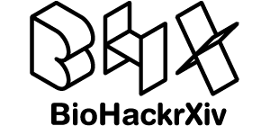
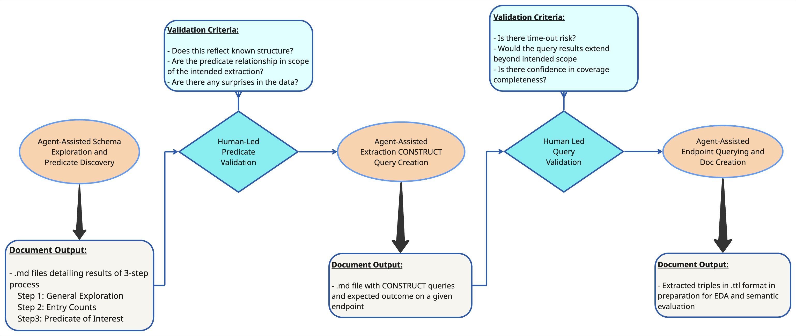

# Introduction

As part of the DBCLS BioHackathon 2026, we developed tools and workflows for identifying and extracting target data from RDF resources with complex schema and named-graph structures. This work was carried out in the context of the Human Glycome Atlas Project (HGA) and the development of the Total Human Saccharide Atlas (TOHSA), which aims to integrate human glycoscience data into a linked knowledge resource. Existing resources such as GlyCosmos contain relevant information about glycans, glycoproteins, genes, pathways, diseases, and related biological entities, but these data are distributed across multiple datasets, graph structures, identifiers, and schema conventions. Building a human-focused resource from these sources therefore requires a reproducible way to determine which data are in scope, how those data are connected, and how they should be extracted.

Large language model (LLM)-based agents can assist with this type of schema exploration by examining repository configuration, generating exploratory SPARQL queries, following graph relationships, and documenting observations. However, the resulting decisions still require validation by subject matter experts. We therefore developed an agent-assisted data extraction workflow that alternates between agent execution and human validation. The workflow covers schema exploration, identification of human-specific criteria, predicate discovery, drafting of SPARQL `CONSTRUCT` queries, validation of those queries, and extraction of RDF in Turtle format. A companion SPARQL endpoint tool was also developed to support inspection and evaluation of the data during this process.

The extraction process also exposed problems that begin after the target RDF has been identified. TOHSA must represent derived scientific relationships consistently, serve the resulting RDF through database engines without unintended changes in query behavior, and prevent access-controlled data from being exposed outside an authorized context. We therefore extended the BioHackathon work beyond extraction to examine materialization before serving, RDF engine conformance, the AAII authorization boundary, and stronger isolation of protected data. Together, these activities address a connected workflow from source-data exploration and extraction through semantic serving and governed access.

<!--
## Meeting information

If you want to submit a preprint to BioHackrXiv, first check if your meeting is registered. You can find a list
of meetings [here](https://index.biohackrxiv.org/meetings). If your meeting is missing, please contact your meeting
organizers. The above list also provides information on the YAML fields with information about the meeting.

The following fields need to be given:

```YAML
biohackathon_name: "DBCLS BioHackathon 2026"
biohackathon_url:   "https://2026.biohackathon.org/"
biohackathon_location: "Matsuyama, Japan, 2026"
group: YOUR-PROJECT-NAME-GOES-HERE
git_url: https://github.com/yourOrganization/your_report_repo
```

The [BioHackrXiv meeting pages](https://index.biohackrxiv.org/meetings) provide content to use for the first
three fields. The `git_url:` field must have the link to the GitHub repository with your preprint (draft).

## Author information

Information about the authors is given in the [YAML](https://en.wikipedia.org/wiki/YAML) format at the top of this template.
For authors you provide their names, their affiliations. That is the minimum, but as BioHackrXiv is moving to a situation
where more metadata is shared, and used by, for example, EuropePMC, adding additional information ie encouraged.

BioHackathons is about hacking together, and the minimal number of authors for reports is two. This makes a minimal example
look like this:

```yaml
authors:
  - name: First Author
    affiliation: 1
  - name: Last Author
    affiliation: 2
affiliations:
  - name: First Affiliation
    index: 1
  - name: ELIXIR Europe
    index: 2
```

### Author identifiers

Ideally, authors provide their [ORCID](https://orcid.org/) identifier. For affiliations, It is added with the `orcid:` field.
So, and author record would look like this:

```yaml
authors:
  - name: First Author
    affiliation: 1
    orcid: 0000-0000-0000-0000
```

### Research Organization Registry identifiers

Matching the author identifier, the affiliations can be further specified with the
[Research Organization Registry](https://ror.org/) (ROR) identifier.
For example, this is the affiliation identifier can be added with the `ror:` field:

```yaml
affiliations:
  - name: ELIXIR Europe
    ror: 044rwnt51
    index: 2
```

### Contributor Role Taxonomy

A last feature since is minimal support for the Contributor Role Taxonomy (CRediT). You
can specify the role of authors in writing the report with the `role:` field. However,
the authors are responsible for selection the right terms from [CRediT](https://credit.niso.org/).
An example looks like this:

```yaml
authors:
  - name: First Author
    affiliation: 1
    orcid: 0000-0000-0000-0000
    role: Conceptualization, Writing – review & editing
```

### A full examples

A full example then has this structure:

```yaml
authors:
  - name: First Author
    affiliation: 1
    role: Writing – original draft
  - name: Last Author
    orcid: 0000-0000-0000-0000
    affiliation: 2
    role: Conceptualization, Writing – review & editing
affiliations:
  - name: First Affiliation
    index: 1
  - name: ELIXIR Europe
    ror: 044rwnt51
    index: 2
```

# Formatting

This document use Markdown and you can look at [this tutorial](https://www.markdowntutorial.com/).

## Subsection level 2

Please keep sections to a maximum of only two levels.

## Tables

Tables can be added in the following way, though alternatives are possible:

```markdown
Table: Note that table caption is automatically numbered and should be
given before the table itself.

| Header 1 | Header 2 |
| -------- | -------- |
| item 1 | item 2 |
| item 3 | item 4 |
```

This gives:

Table: Note that table caption is automatically numbered and should be
given before the table itself.

| Header 1 | Header 2 |
| -------- | -------- |
| item 1 | item 2 |
| item 3 | item 4 |

## Figures

A figure is added with:

```markdown

```

This gives:


Figures can be scaled by adding the width or height to the Markdown like this:

```markdown
{ width=50px }
```

You can add cross references to figures by adding a LaTeX `\label{figureCode}` to
the label of the Markdown figure and then use `\ref{figureCode}` to cite it:

```markdown
{ width=50px }
```

This way, we can cite Figure \ref{figureCode}.

# Other main section on your manuscript level 1

Lists can be added with:

1. Item 1
2. Item 2

# Citation Typing Ontology annotation

You can use [CiTO](http://purl.org/spar/cito/2018-02-12) annotations, as explained in [this BioHackathon Europe 2021 write up](https://raw.githubusercontent.com/biohackrxiv/bhxiv-metadata/main/doc/elixir_biohackathon2021/paper.md) and [this CiTO Pilot](https://www.biomedcentral.com/collections/cito).
Using this template, you can cite an article and indicate _why_ you cite that article, for instance DisGeNET-RDF [@citesAsAuthority:Queralt2016].

The syntax in Markdown is as follows: a single intention annotation looks like
`[@usesMethodIn:Krewinkel2017]`; two or more intentions are separated
with colons, like `[@extends:discusses:Nielsen2017Scholia]`. When you cite two
different articles, you use this syntax: `[@citesAsDataSource:Ammar2022ETL; @citesAsDataSource:Arend2022BioHackEU22]`.

Possible CiTO typing annotation include:

* citesAsDataSource: when you point the reader to a source of data which may explain a claim
* usesDataFrom: when you reuse somehow (and elaborate on) the data in the cited entity
* usesMethodIn
* citesAsAuthority
* citesAsEvidence
* citesAsPotentialSolution
* citesAsRecommendedReading
* citesAsRelated
* citesAsSourceDocument
* citesForInformation
* confirms
* documents
* providesDataFor
* obtainsSupportFrom
* discusses
* extends
* agreesWith
* disagreesWith
* updates

There is a general `cites` intention, but this is already implied and should be left out.
-->

# Abstract
The Human Glycome Atlas Project aims to integrate human glycoscience data into a linked RDF resource connecting glycans and glycoconjugates with their biological context. Constructing such a resource from existing knowledge bases requires reproducible identification and extraction of human-relevant data, preservation of semantic behavior when the resulting RDF is served through different graph engines, and appropriate control over access to protected data. During DBCLS BioHackathon 2026, we developed an agent-assisted, human-validated workflow for exploring complex RDF schemas and generating SPARQL CONSTRUCT extraction queries. We further developed a cross-engine conformance framework for evaluating RDF serving behavior and advanced the AAII authorization architecture used to mediate access to TOHSA data. Together, these activities connect source-data discovery, reproducible extraction, semantic serving, and governed access into a common workflow for constructing and operating the TOHSA knowledge base.

# Agentic Assisted Data Extraction 
The workflow implemented at BioHackathon is an exchange of supervised task execution by the agent, and validation by the subject matter experts. The workflow (depicted below) consists of agent exploration, human validation, agent creation of extraction queries, human evaluation of those queries, and finally agent-facilitated querying of the endpoint with CONSTRUCT queries resulting in data files written in .ttl format. These files are meant to be compatible with mathematic evaluation via Exploratory Data Analysis (EDA) and/or semantic evaluation via human-facilitated querying. Developing the criteria for those final data evaluation steps was outside the scope of this BioHackathon, but it is planned as a future step for this project. All steps are intended to be iterable within and across themselves to allow for dynamic and documented changes resulting from discoveries about the data, changes in desired target or scope, or adjustments due to human or agent error.



## Multi-Step Schema Exploration
To provide understanding about the structure of the linked data, a three-step analysis is applied to each dataset. The agent determines which files in the context repository feed into which named graph, what predicate points to taxonomic information, and what corresponding object marks a resource as human. This is done while consulting the available config files, and ultimately confirms the veracity of all observations with live queries. The exploration queries return the full human IRI count, picking one richly connected real instance and follows every predicate out from it to determine the range of relevant triples. This path exploration identifies what is safe to include in an extraction scope, what is a shared resource across graphs and potentially needs its own table, and whether or not a predicate carries a fan-out risk.

For each step, the agent creates an .md file that describes observations about the data structure. This analysis is not static, and if future steps reveal something previously unknown or poorly categorized, the agent returns to the .md document and amends it before the task is declared complete and the full .md file shared with the user. The details included in those observations are described below:

**Step One: extraction criteria** Defines which predicate and value combination marks a resource as whatever the intended extraction target, in this case as human. This step runs queries with the intention of proving every claim with a live SPARQL query, and states plainly where a criterion rests in a dataset's documented scope. These queries are saved as separate files in the appropriate directory, and are directly hyperlink-referenced in the observations summary. 

**Step Two: entry counts** Runs count queries for target criterion from step one against the full live dataset without `LIMIT` conditions, and records the returned count with the query used to obtain it. Where more than one independent signal exists for the same criterion, this step check them against each other and investigates any disagreement with additional queries to the live endpoint rather than picking one arbitrarily.

**Step Three: predicate discovery** Selects one richly linked, already confirmed instance and enumerates every predicate on every resource directly reachable from it, unrestricted. This identifies which predicates could be problematic during an extraction step. Problematic predicates include those that result in a fan-out path because the object URI is cited by thousands of other records, opaque identifiers with no further content, and predicates that are mislabeled. These predicates and paths are caught before they become a silent gap or an unbounded query in a production pipeline.

Below is a summarized example of the conclusions from an agent-assisted exploration of multiple datasets:

| Dataset | Criterion | Count | Key finding |
|---|---|---|---|
| Disease | Two levels, DOID membership (concept) plus gene or glycoprotein `glycan:has_taxon` (molecular evidence) | 4115 of 4372 | The invented `pipeline:hasPhenotype` predicate was found and replaced with the real four hop bridge |
| Pathways | `biopax3:organism`, direct, confirmed two independent ways | 2870 of 23486 | Three pipeline bugs found in a deep cross check, a self referencing related pathway bug, a missed nested sub pathway reaction gap, and an uncollected output variable |
| Genes | `glycan:has_taxon` directly on `glycan:Glycogene` | 10276 | A ggdb (GlycoGeneDataBase) sub analysis was built separately on that named graph's own rich reaction content |
| Glycoproteins | `glycan:has_taxon` directly on `glycan:Glycoprotein` | 16711 | A numeric pattern gene target's own triples span six graphs, not two; a related_graphs sub analysis covered four further graphs (gpdb, HPA, lipidmaps_gene, protein_egf) |
| Lectins | `glycan:has_taxon` directly on `sugarbind:Lectin` | 318 of 6298 | CarboGrove, reached through one `rdfs:seeAlso` hop, expands into 1.3 million triples, a confirmed fan out hub, excluded |
| Glycans | Two hop `glycan:is_from_source`/`glycan:has_taxon` | 8042 of 265401 | A directory named `external` holds none of the resource type its name implies; the extraction package's own inference dependent query proved unnecessary; two pipeline bugs found and fixed |
| Glycolipids | None exists, confirmed by exhaustive live checking | 6046 (full population, no species filter possible) of 6280 store wide | No species predicate anywhere in the dataset; the scope decision to cover the full population was made without a response from the person directing the work, and is flagged for confirmation |

## `CONSTRUCT` Query Drafting
Once the subject matter confirms that the agent has an accurate representation of the data structure and how the target data fits into that structure, the agent begins to draft CONSTRUCT queries. Compared to extraction with `SELECT` queries, `CONSTRUCT` queries do not require an additional step of triple reconstruction across tables, and ensure fidelity between target triples and the extracted triples. The agent crafts those queries with a multi-step decision process:

**Step One: verify instance schema** The expert's own instance level schema diagram (in .png or .yaml format) is checked edge by edge against the live endpoint before a single query is written. Every edge it shows is either confirmed real and present exactly as drawn, or the discrepancy is surfaced immediately and documented for expert review.

**Step Two: verify filter scope** A target criteria can restrict which entries appear in a query, or it can restrict which entries get expanded. These are different decisions, and a `CONSTRCT` query has to be deliberate about which one it is making. Verification at this decision point is important to ensure outputs do not include dangling references.

**Step Three: split queries that cause timeout errors** Performance is checked by the agent while a query is still being drafted, and splits into separate queries if necessary. The split is kept permanently in the document once drafted. This is out of abundance of caution, and is a decision point to address if significant changes are made to the database that make the split unnecessary, or require a split along a different retrieval pattern. 

**Step Four: retain pointer URI discipline** Object URIs whose expansion created a fan out risk are confirmed, and the scope of the extraction is restricted to end at the final URI connected to this risky predicate, aka a "pointer URI". The restriction discipline that was established in the dataset's own `tohsa_step3_predicate_discovery.md` that identified the pointer URIs is maintained.

**Step Five: perform deep cross check** Before the `CONSTRUCT` query document is published for an expert's independent review, a full adversarial pass over all drafted queries for the dataset of interest is run after the rest of the document otherwise looks complete. Every check is live against the endpoint, not inferred from the previous query text.

**Step Six: correct and amend queries based on expert review** A second round of expert review can show an earlier query was incomplete or incorrect. When a specific numeric disagreement is raised by the expert, it is first confirmed by reproducing the expert's own query. Then if target triple coverage is insufficient or incorrect, an ammendment is noted in the prose documents, and the incorrect query is overwritten. For example, the first draft of queries for the Disease dataset contained a "Query C" that restricted a phenotype bridge to cross references containing the literal string "OMIM". A second expert diagram showed this coverage is incomplete, and the corrected version was replaced with a new Query D, with a short note explaining why. Keeping both risks a future reader running the narrower, incomplete query by mistake.

**Step Seven: cite all queries in docs.** Every SPARQL query used for confirmation, exploration, and cross checks, and worked example in `query.md` is linked to its own numbered entry in `refDocs/query.md`. The generated directory uses the same `[[N]](../refDocs/query.md#N-slug)` naming convention already used for `tohsa_step1_extraction_criteria.md` through `tohsa_step3_fetch_summary.md`, with its own independent numbering, not continuing the step documents' own sequence.

# Future Workflow Development 
The extraction workflow produces both the target RDF and a documented record of how the extraction scope was identified and validated. However, this record is prose heavy, and could be simplified into a more structured format that is still human readable, but easier for other agents to engage with. Standard RDF-config files in .yaml format are already commonly used to document RDF schema, and could serve as an appropriate addition to the prose. The simplified and structured .yaml files could facilitate new ways to extend the workflow beyond extraction as we continue development. 

Extraction is only the first step in incorporating these data into TOHSA. Once an extracted RDF dataset has been validated, the intended scientific relationships need to be represented consistently, the data need to be served without unintended changes in query results, and access-controlled data need to be exposed only through the appropriate authorized context. These requirements led to additional work on materialization, RDF engine evaluation, and the AAII authorization and serving architecture.

# RDF Engine Evaluation and Semantic Serving

The extraction workflow identifies which source triples belong in a human-focused dataset. Serving those data introduces separate requirements: derived scientific statements must be represented consistently, RDF engines must return the expected SPARQL results, and protected data must remain within the authorized query scope. We therefore evaluated materialization, cross-engine behavior, and authorization as separate parts of the TOHSA serving workflow.

## Materialization Before Serving

TOHSA combines RDF from multiple sources and may add statements through ontology, mapping, or propagation rules. If these statements are inferred at query time, results can depend on the inference capabilities and configuration of the RDF engine answering the query. We instead explored materializing approved derived statements into a canonical release before serving, allowing normal query execution to operate without engine-specific scientific inference.

This separates the scientific contents of a release from the behavior of the engine serving it. A synthetic release was created to test this approach before applying it to the larger GlyCosmos extraction. It could be rebuilt deterministically from the same inputs, with derived statements stored directly in the RDF. Representation decisions could therefore be evaluated independently of engine behavior. For example, integer lexical forms were normalized during release construction while preserving RDF datatype identity; decimal and floating-point normalization were deferred because the significance of lexical precision for measurement values remains unresolved.

## RDF Engine Conformance Evaluation

A conformance test suite was then developed to determine whether different RDF engines could serve the same release with the behavior required by TOHSA. Virtuoso, QLever, and RDF4J NativeStore were tested using the same synthetic release, queries, and expected results. Tests focused on default and named graph behavior, RDF term identity, and SPARQL aggregation.

The engines showed different failure patterns. Virtuoso produced duplicate matches when identical triples occurred in overlapping graphs selected into the default dataset. QLever handled that case correctly but did not preserve some integer datatype distinctions and returned a different datatype for some aggregate results. Both Virtuoso and QLever changed the lexical form of the decimal test value. RDF4J preserved the tested integer and decimal distinctions, but reproduced the overlapping-graph behavior seen in Virtuoso and showed a separate aggregate-count difference.

No engine satisfied every requirement in the current direct-serving profile. Because the failures differ by engine, correcting results after execution is not a general solution; operations such as adding `DISTINCT`, removing rows, or rewriting returned datatypes could also alter valid results. TOHSA therefore treats the canonical release and the query service as separate responsibilities: the release defines the scientific RDF, while a service profile defines the SPARQL behavior an engine must satisfy before it can serve that release.

The synthetic suite remains useful because each case isolates a specific RDF or SPARQL behavior. Future evaluation can apply the same framework to the GlyCosmos-derived human dataset while adding queries based on its actual scientific structure.

## AAII Authorization and Serving Boundary

Engine conformance is separate from authorization. TOHSA's Authentication and Authorization Infrastructure (AAII) determines which graph scope a requester may access before the query is sent to an RDF engine.

During the BioHackathon, this boundary was made explicit by retaining the authorization result as a structured query plan containing the parsed query and its authorized default and named graph sets. The engine-specific query is generated from that plan, and a verifier checks immediately before execution that the dispatched dataset and query still match the authorized scope. Tests with Virtuoso and QLever demonstrated that unauthorized graph scope could be rejected before execution.

This distinction is important: an engine can receive only the graphs a user is permitted to access and still fail an independent semantic-conformance requirement. Authorization testing and RDF engine conformance testing therefore remain separate.

Further work is required to bind authorization to a specific release and serving target and to define the governance process by which protected-data access is approved. Existing agreements may provide evidence for an access decision, but they should not automatically be interpreted as authorization.

## Protected Data and Physical Isolation

Because some TOHSA data may be restricted, we also evaluated stronger physical isolation as a complement to query-time authorization. A prototype used immutable release artifacts and separate serving targets to test release identity, reconstruction of a serving target, rejection of release mismatches, and separation of public and protected data.

This prototype demonstrated that physical separation can provide an additional containment boundary, but it did not establish the final deployment topology. The current architecture can operate with public and protected data in one knowledge graph under separate access paths, while retaining the option to move to separate public and protected serving targets in the future. Such a change would strengthen isolation without requiring the underlying authorization model to be redesigned.

The prototype also reinforced the distinction between scientific data and user permissions. A release identifies the data being served, while authorization determines which portions of that release a user may query. Multiple users can therefore receive different access to the same scientific release without creating a separate release for each user.

Together, these activities extend the extraction workflow into a reproducible serving process: extraction determines which source data are included, materialization fixes the intended scientific statements, conformance testing evaluates whether an RDF engine serves those statements correctly, and AAII controls the graph scope available to each requester.

# Collaborative Query Review with ODIN

ODIN was used as a collaborative query workspace to support the extraction and RDF engine evaluation activities described in this report. During schema exploration and extraction, the workflow produces a large number of SPARQL queries used to establish extraction criteria, investigate data structure, verify individual relationships, and cross-check the resulting extraction queries. ODIN provides a shared environment in which these queries can be run against the relevant endpoints, retained for later review, and annotated by project members. This complements the query files maintained with the extraction documentation by making the evidence behind extraction decisions easier to inspect and discuss as a team.

The same approach is useful during RDF engine evaluation. Engine conformance testing depends on running equivalent queries against different RDF implementations and determining whether differences are caused by the scientific data, the query itself, or the behavior of the serving engine. ODIN provides a practical interface for running and reviewing these queries across endpoints and retaining the associated discussion. In this role, ODIN does not define the extraction criteria or the expected semantic behavior of an RDF engine; those remain defined by the extraction documentation and conformance test suite. Instead, it provides a shared workspace for examining the queries and results used in those processes.


Future development could connect ODIN more directly to the documented extraction and conformance workflows. For example, extraction queries and their supporting validation queries could be imported as a defined query set, while engine-evaluation queries could be grouped by the semantic behavior they test. This would make ODIN a common review interface for the query evidence produced during both data extraction and RDF engine qualification without replacing the reproducible files and automated tests that provide the authoritative project record.


...

## Acknowledgements

We thank Evan Bolton, Daniel Puthawala, Gos Micklem, Yasunori Yamamoto, and Issaku Yamada for their technical discussions, feedback, and support during the DBCLS BioHackathon 2026.

# References

```{=latex}
\AtEndDocument{%
```

# Appendices

If you want the Appendix (-ces) to show up after the references, wrap them in 
after the header, like done in this Markdown file. Look at the [source](paper.md)
to see the exact structure.

```{=latex}
}
```
